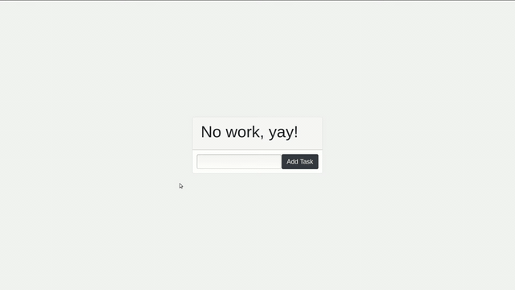

# React Todo App
A simple todo app to learn basics of React.



## Instructions
Install dependencies. Make sure you already have nodejs & npm installed in your system.
```
$ npm install # or yarn
```
Run it
```
$ npm start # or yarn start
```
### Built With
* React
* Bootstrap


## Authors
* Vallari Agrawal - [VallariAg](https://github.com/VallariAg)
